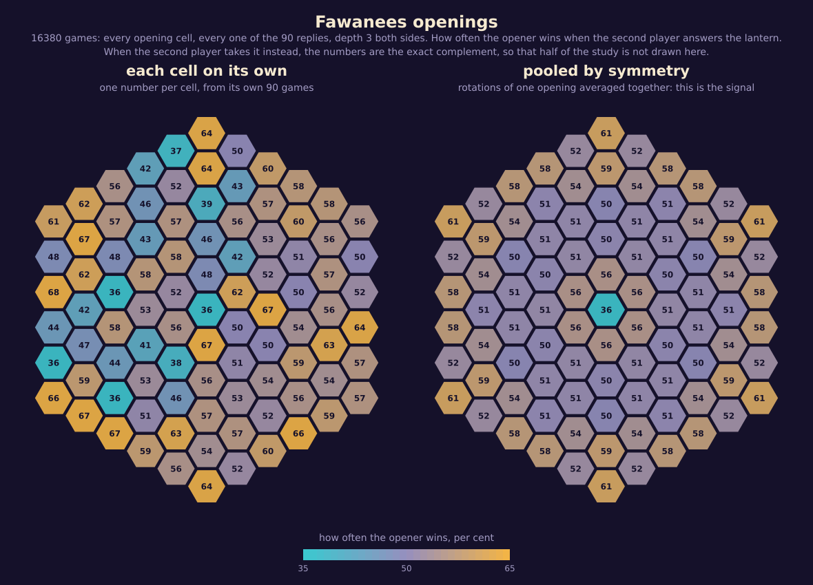

# Balance

How fair the game is, measured; and what it would take to make the games closer.

Everything here comes from self-play at equal strength, depth 3 on both sides, on the current rules
(`K: 3, M: 1, supply: 24, range: 2`, radius 5) unless a row says otherwise. How the games are set up,
and why the setup matters as much as the result, is in [METHOD.md](METHOD.md).

## The headline

| | |
|---|---|
| First player, no swap rule, best opening | **61.3%** |
| First player, no swap rule, averaged over all 91 openings | **53.8%** |
| First player, no swap rule, opening in the centre | **35.6%** |
| First player, with the swap rule, playing the shipped policy | **48.7% ± 1.7** |
| Last lead change | **37.4% ± 1.0** of the way through the game |
| Comeback rate (the eventual loser led at halfway) | 21.5% |
| Average final margin | 44.9 points |

The first player's advantage is real, and the swap rule is what removes it. Those are two separate
facts and the earlier draft of this document ran them together.

- **Target: 45–55% for the first player at equal strength.** Met, at 48.7% ± 1.7.
- **Target: the last lead change after 40% of the game.** Not met, at 37.4% ± 1.0. This is not a
  near miss; the interval is [36.4, 38.4].

## Two corrections to how this was measured

**The prototype's harness handicapped the first player.** It began each game with two random moves,
which gave gold two unsearched moves and turquoise one. That asymmetry alone is worth about fifteen
points. Most of the difference between the prototype's 70% and anything here is that, not the game.
The study now enumerates every reply instead of sampling, and gives each side exactly one unsearched
move: the opening cell, which the study is about, and the reply, which is enumerated over.

**Alpha-beta's root scores are not comparable with each other.** Only the best move's value is
exact; the rest are upper bounds. Anywhere a measurement compares moves — the puzzle mine, the
uniqueness margins — it now uses `Engine.rootScoresExact`, which searches every root move with a
full window.

## The swap rule is the pie rule, and it caps the opener at 50%

Taking the opening lantern leaves exactly the position that answering it leaves, with the two
colours exchanged. So for any opening, the opener's chance after a swap is one minus their chance
without one. Across all 91 cells the two branches add to 100% to within **2.2 points** — the residual
is the 0.4% draw rate plus the search not being quite colour-symmetric.

That has three consequences worth stating plainly.

1. Half the study was redundant, and a future one can measure one branch and derive the other.
2. The second player's decision is not subtle: take the lantern whenever the opening favours the
   opener. They take it on 84 of the 91 cells.
3. The opener can never do better than the opening whose rate is closest to 50%. The rule does not
   *reduce* the first player's advantage so much as *hand the choice of seat to the other player*,
   which is a stronger thing. The game is fair because no opening is worth choosing that the
   responder cannot punish by swapping seats.

The check that this is implemented correctly is that 2.2-point figure. If the swap were wrong, or
the engine badly colour-asymmetric, the two branches would not be complements.

## Which openings are worth what

Pooled by symmetry class, without the swap rule, 8,190 games:

| opening | cells | first player keeps it | under the swap rule |
|---|---|---|---|
| ring 5 corner (-5,0) | 6 | 61.3% ±3.4 | 38.7% |
| ring 4 corner (-4,0) | 6 | 59.1% ±4.3 | 40.9% |
| ring 5 edge (-5,2) | 12 | 58.0% ±4.7 | 42.0% |
| ring 1 (-1,0) | 6 | 55.7% ±5.9 | 44.3% |
| ring 4 (-4,1) | 12 | 54.4% ±4.9 | 45.6% |
| ring 5 (-5,1) | 12 | 52.5% ±5.3 | 47.5% |
| ring 2 (-2,1) | 6 | 51.5% ±8.4 | 48.5% |
| ring 3 (-3,1) | 12 | 51.1% ±3.7 | 48.9% |
| ring 4 (-4,2) | 6 | 50.6% ±4.5 | 49.4% |
| ring 2 corner (-2,0) | 6 | 50.4% ±5.0 | **49.6%** |
| ring 3 corner (-3,0) | 6 | 49.6% ±6.0 | **49.6%** |
| centre (0,0) | 1 | 35.6% | 35.6% |

The centre is by far the worst opening: it is the one cell whose light is answered from every
direction at once.

### The error bars are not binomial, and that matters

Cells of one symmetry class are the same opening rotated. They should give identical numbers. They
do not: they differ by about ten points, far more than the ±5 a binomial on 90 games would predict.
The reason is that the search breaks ties by cell index, so two mirrored positions pick different
moves among equals and the games diverge from there.

So the per-cell map is mostly the engine's arbitrary choices, and only the pooled numbers carry
signal. The intervals above are the spread between cells of a class, divided by the square root of
how many there are — which is the honest error bar for "what is this opening worth".

This also means a responder who picks its swap decision per *cell*, from the same games it is
scored on, is selecting on noise: doing that moved the measured first-player rate down by five
points, from 48.7% to 43.9%. The shipped policy decides per symmetry class, from the pooled study.

## The policy the machine plays

Generated into `src/opening.js` by `sim/makeOpeningPolicy.js`:

- **As the opener:** choose at random among the 36 cells whose openings sit within two points of the
  best. Two points is finer than this study can resolve, so the machine gives nothing away by
  varying, and a human never sees the same first move every game.
- **As the responder:** take the opening lantern on the 84 cells where the opening favours the
  opener; answer it on the other 7.

Played end to end, that policy gives the first player 48.7% ± 1.7 over 3,240 games.

## The game is decided early, and the games are lopsided

The one target that is missed is the interesting one. The last lead change lands at 37.4% of the
game, and the average final margin is 44.9 points on a board where about 91 are available — the
typical game ends something like 68 to 23. Once someone is ahead in Fawanees, they tend to stay
ahead and extend.

## Candidate rule changes

**No rule change has been applied.** This is the evidence, not a decision.

Each variant is played from its own balanced openings, found by a separate opening study, so none
of them is judged on openings that were chosen for a different rule set. A "chain" here means a
capture that resolved in two waves or more -- one lantern switching and thereby causing the next.

| measure | K=3, M=1 (current) | K=3, M=2 | K=4, M=1 |
|---|---|---|---|
| first player | 48.7% ±1.7 | 46.5% ±2.4 | 40.6% ±2.1 |
| last lead change | 37.4% ±1.0 | 38.6% ±1.3 | 45.4% ±1.2 |
| comeback | 21.3% | 19.2% | 25.0% |
| avg margin | 44.9 | 38.3 | 24.0 |
| chains / game | 4.32 | 1.71 | 1.99 |
| games with a chain | 99.0% | 81.6% | 90.5% |
| biggest chain (avg) | 3.1 | 2.3 | 2.2 |
| biggest chain (ever) | 7 | 5 | 6 |
| captures / game | 18.0 | 17.0 | 12.5 |
| lanterns flipped / game | 25.2 | 20.0 | 15.3 |
| games | 3240 | 1620 | 2160 |
| opening cells used | 36 | 18 | 24 |
| responder takes the lantern on | 30 of 36 | 0 of 18 | 24 of 24 |

Every reply enumerated, depth 3 both sides.

### Reading it

**K=3 with M=2 is dominated.** Requiring attackers to outnumber defenders by two rather than one
was the obvious middle road: keep three-seer capture, just make it harder. It does not work out
that way. It costs *more* chains than K=4 does -- 1.71 a game against 1.99, and only 81.6% of games
contain one at all against 90.5% -- while buying almost nothing on the target: 38.6% against 37.4%,
still short of 40%. It is worse than K=4 on both axes at once.

The reason is that M=2 does not make capture rarer, it makes *chains* rarer. Captures per game
barely move (18.0 to 17.0), but a lantern that has just switched sides now needs two more attackers
than defenders to carry the chain on, and that second wave usually does not arrive.

**K=4 buys the dynamics target and pays for it in chains.** The last lead change moves from 37.4%
to 45.4%, comfortably past the target. The average margin nearly halves, 44.9 to 24.0, which is the
bigger prize: games stop being blowouts. Comebacks rise from 21.3% to 25.0%.

Against that, chains per game fall by more than half, 4.32 to 1.99. But the spectacle does not
disappear: 90.5% of games still contain at least one chain, and the largest chain ever seen across
the whole study only falls from 7 to 6. What changes is frequency, not ceiling. A chain becomes
something that happens twice a game instead of four times.

**The 40.6% for K=4 is a floor, not a verdict.** Its openings were chosen from a cheap study --
one cell per symmetry class, 90 games each, so about ±10 points. All three of the openings picked
turned out to favour the opener when answered, which is why the responder takes the lantern in
every single game and the opener lands at 40.6%. Under the pie rule the opener's rate is
`min(p, 1-p)`, so a properly chosen K=4 opening should land much nearer 50%. Confirming that needs
the full K=4 opening study, 8,190 games, about fifteen minutes. It has not been run.

So the honest state of it: K=4 clearly fixes the dynamics, clearly costs chain frequency, and its
effect on balance is not yet measured well enough to quote.
